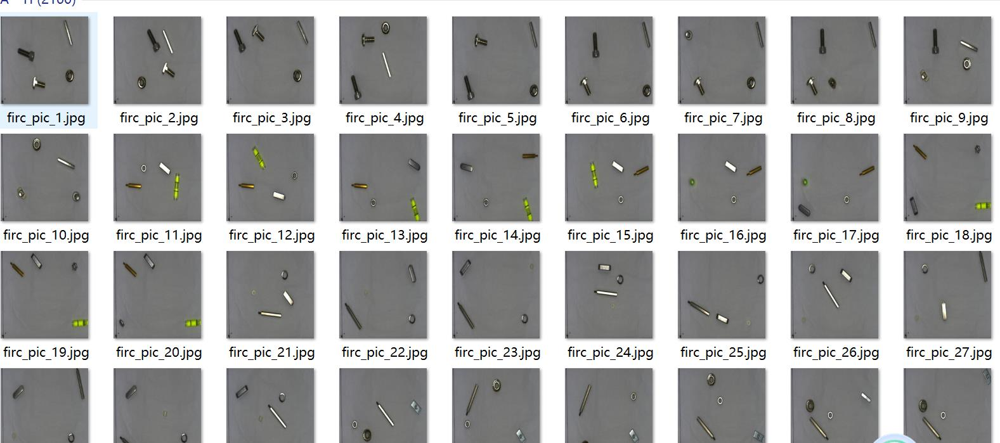
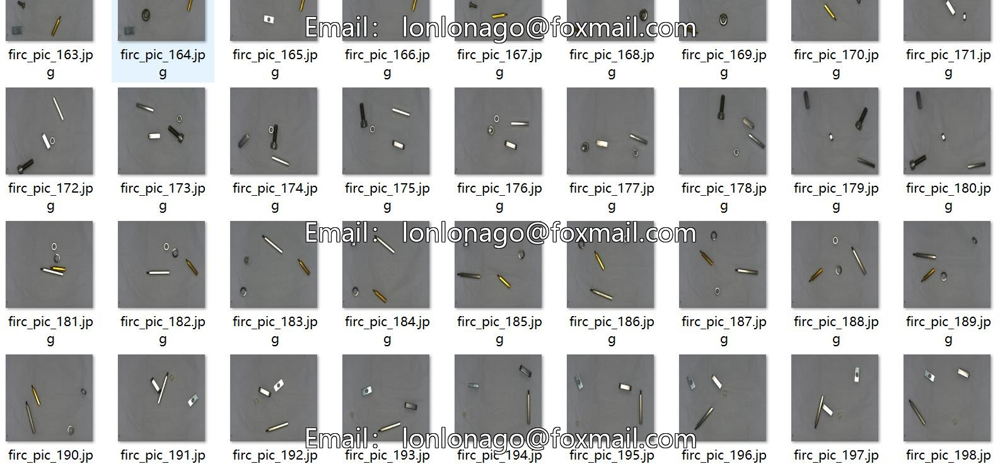
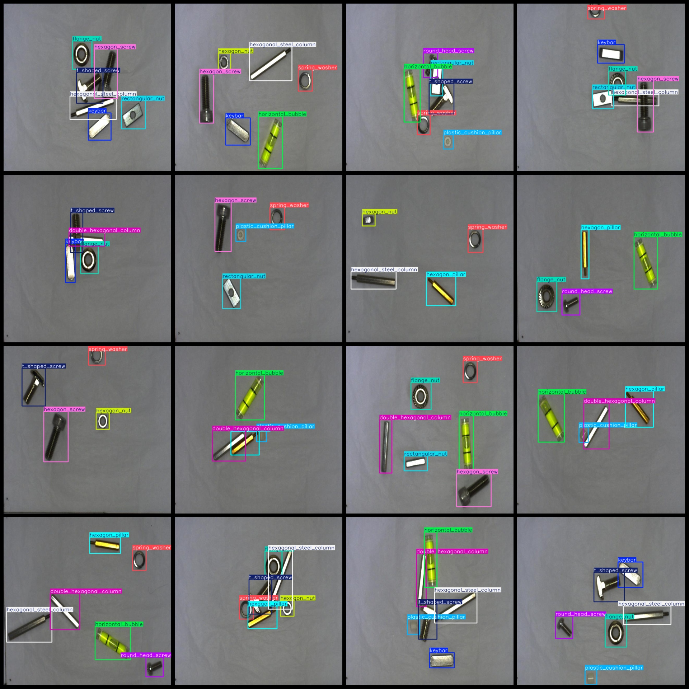
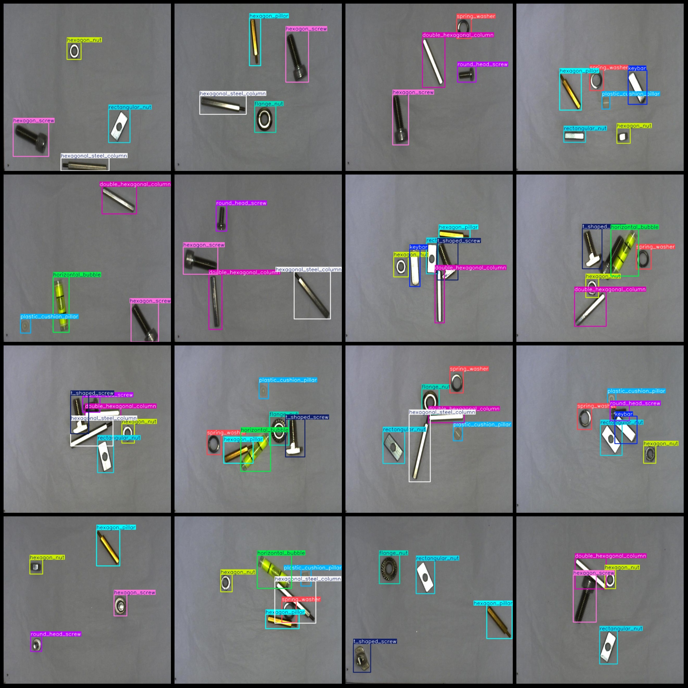

# 13-class Industrial Part Detection Dataset in VOC+YOLO format with 2100 examples

```markdown
# 13 types of industrial parts detection dataset VOC+YOLO format with 2100 images in 13 categories

Dataset format: Pascal VOC format + YOLO format (excluding split paths, only containing jpg images and corresponding VOC format xml files and yolo format txt files)
Number of image files (jpg): 2100
Number of annotation files (xml): 2100
Number of annotation files (txt): 2100
Number of annotation categories: 13
Annotation category names (note that the order of categories in the yolo format does not correspond to this, but is based on the classes.txt in the labels folder): ["double_hexagonal_column", "flange_nut", "hexagon_nut", "hexagon_pillar", "hexagon_screw", "hexagonal_steel_column", "horizontal_bubble", "keybar", "plastic_cushion_pillar", "rectangular_nut", "round_head_screw", "spring_washer", "t_shaped_screw"]
Box count for each category:  
The number of rectangular nuts is 924.
Number of images in each category:
Flange Nut (Flange Nut) occupies a picture count of 819.
The number of images occupied by the keybar is 898.
Plastic Cushion Pillar (plastic cushion pillar) occupies 864 images.
The number of rectangular nuts (878) occupied is 878.
Round-head screw (round head screw) occupies a picture count of 841.
The resolution of the image is 640x640.
```
## Images






Here is a pay link on Stripe ( https://buy.stripe.com/3cs8yP7sY87d0vu9AB ). Please contact me lonlonago@foxmail.com after funding $89, and I will send you a complete data files , thank you!


